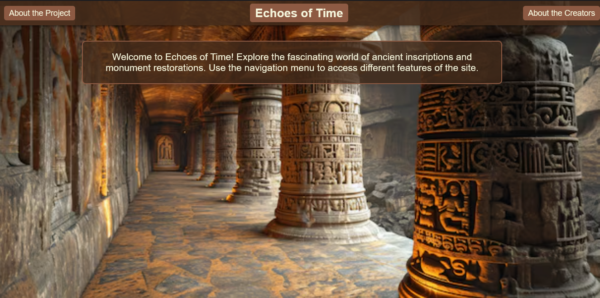
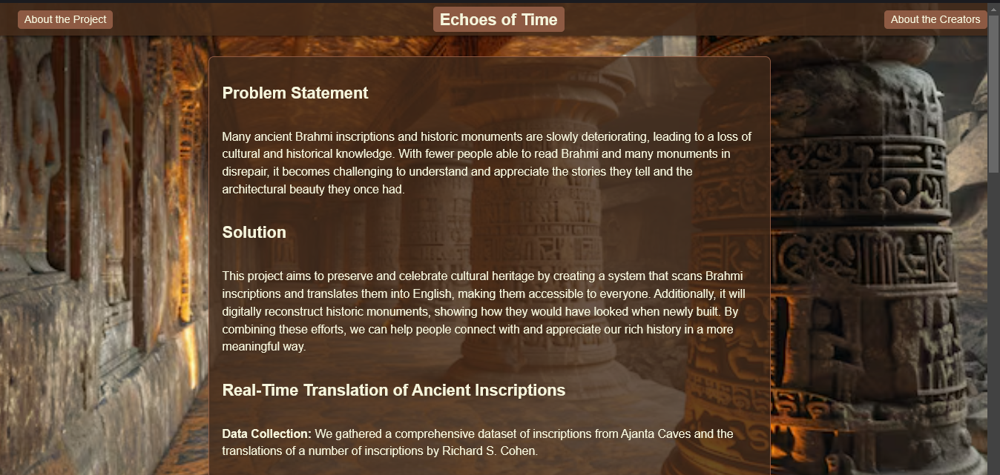
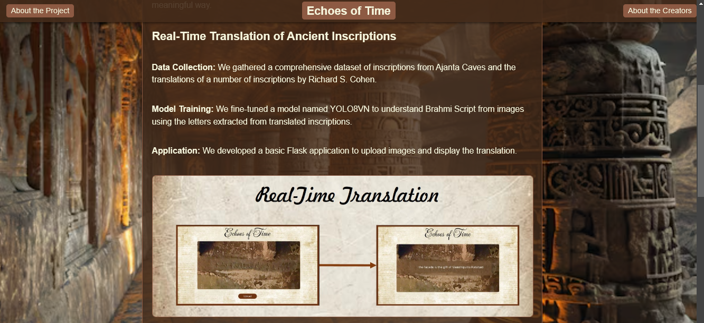
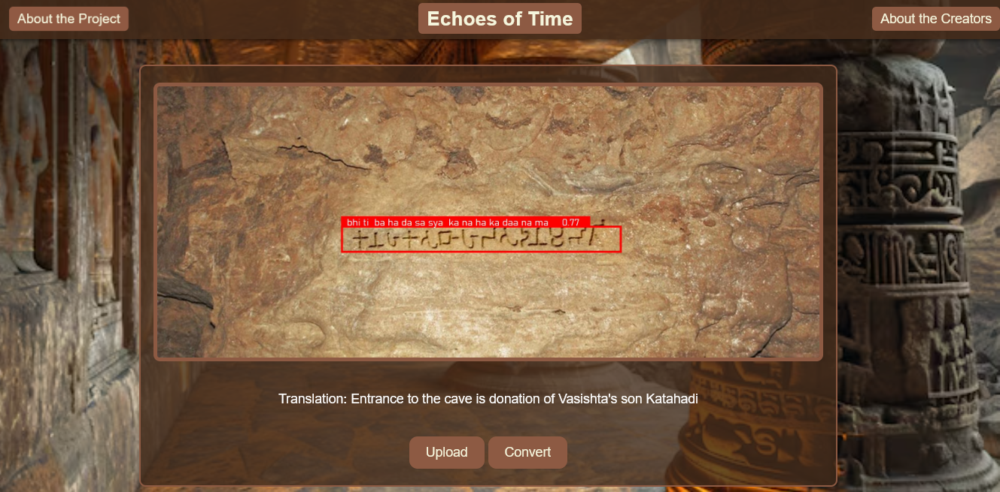
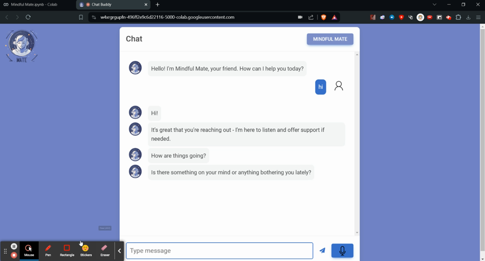
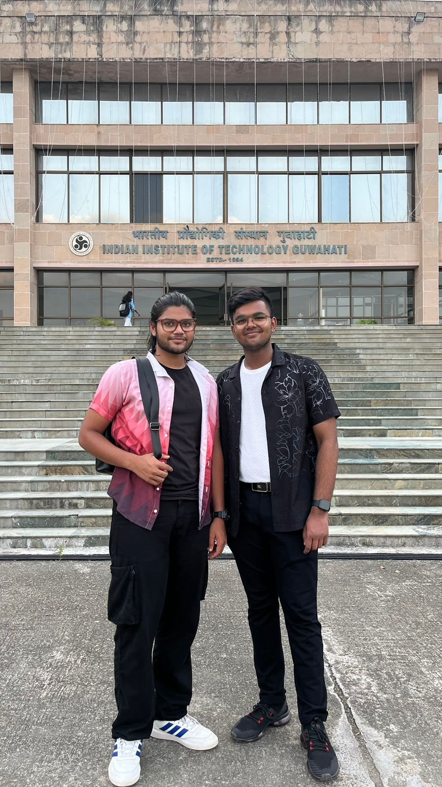
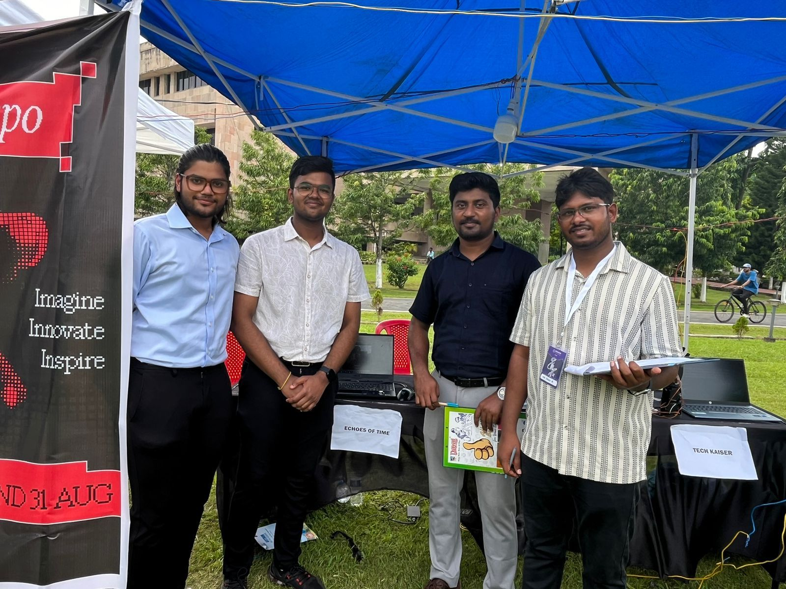

# **Portfolio** 🚀

### **Overview**

Hello, I’m **Samyak Jain**, a passionate tech enthusiast with a deep interest in **Backend Development**, **Artificial Intelligence & Machine Learning (AI/ML)**, and **Cybersecurity**. My experience spans building intelligent systems, developing web applications, and working on innovative projects that aim to solve real-world problems. 🔥

---

## **Skills & Expertise** 🛠️

- **Programming Languages**: Python 🐍, R 📊, HTML, CSS, JavaScript, React.js ⚛️, Node.js
- **Focus**: Backend Development, Data Analysis, Web Development 🌐
- **AI/ML Tools**: OpenCV 👁️, YOLO, DeepFace, Tensorflow, Keras 🧠
- **Other Tools**: Flask, Django, PyQT, TKinter, Roboflow
- **Cybersecurity**: Enthusiast, currently exploring the domain 🔒

---

## **Key Projects** 💼

### **1. Echoes of Time (IIT Guwahati TechExpo 2024 Shortlisted Project)** 🏆

**Problem Statement**: To digitally preserve ancient Brahmi script characters, enabling future generations to understand this ancient language better.  
**Solution**: Developed a custom model for **Brahmi script recognition** using advanced image processing and deep learning techniques. 🌟

#### **Technologies Used**:
- **OpenCV**: Developed an image preprocessing algorithm to remove rocky textures and enhance clarity for character identification.
- **YOLO**: Trained a custom object detection model for recognizing individual Brahmi script characters.
- **Roboflow**: Created a dataset and performed annotation for the Brahmi script characters.
- **Flask**: Deployed the solution as a web app for ease of use and accessibility.

> **Achievement**: Showcased at the prestigious **TechExpo 2024**, IIT Guwahati’s *Techniche*, where it was shortlisted and received high praise from industry leaders. 🌟

#### **Images**:  
- 
- 
- 
- 

---

### **2. Mindful Mate (AI-Powered Mental Health Chatbot)** 💬🧠

**Problem Statement**: Children facing mental health issues such as **depression, anxiety, ADHD, dyslexia, and dysgraphia** often do not receive timely support.  
**Solution**: Built an AI chatbot that uses **facial emotion detection** and **vocal sentiment analysis** to adapt its responses based on the user's emotional state, providing timely and empathetic interactions. ❤️🤖

#### **Technologies Used**:
- **Haarcascade Classifier & DeepFace Library**: Used for **facial emotion detection** to analyze the emotional state of users in real time.
- **Vocal Sentiment Analysis**: Incorporated a sentiment analysis model for voice interactions to provide emotional support.

#### **Images**:  
- 

- *Link to Explanation Video*: 🎥 [Click Here](https://uploadnow.io/s/668298fa-21b0-4148-8391-714fc349a1dc)

---

## **Workshops and Hackathons** 🎓

- **IIT Guwahati Techniche 2024 – TechExpo**: Presented *Echoes of Time*; shortlisted as one of the top innovative projects. 🏅
- **SIC 2023 Winner**: Hosted by the same organization of SIH but at the school level. Visit: [sic.mic.gov.in](https://sic.mic.gov.in/)

---

## **What Drives Me?** 🚀

I am driven by the idea of using technology to **bridge societal gaps**, whether it's through **preserving ancient cultures**, providing **mental health support**, or pushing the boundaries of **innovation in AI/ML**. My projects reflect this passion and demonstrate my ability to turn ideas into **functional, impactful solutions**. 🔍✨

---

## **Get in Touch** 🤝

- **LinkedIn**: [Samyak Jain](https://www.linkedin.com/in/sammyyakk/)
- **Email**: [sammyyakk@gmail.com](mailto:sammyyakk@gmail.com)

---

## **Images & Screenshots** 📸

- 
- 

---

## **Conclusion** 🎯

Through projects like *Echoes of Time* and *Mindful Mate*, I aim to combine **technology with purpose**, creating solutions that make a real impact. I’m excited about the opportunity to participate in **BVP-HEX: Hack Eleven Xpress** and continue my journey of **learning, collaboration**, and **innovation**. 🚀💡
